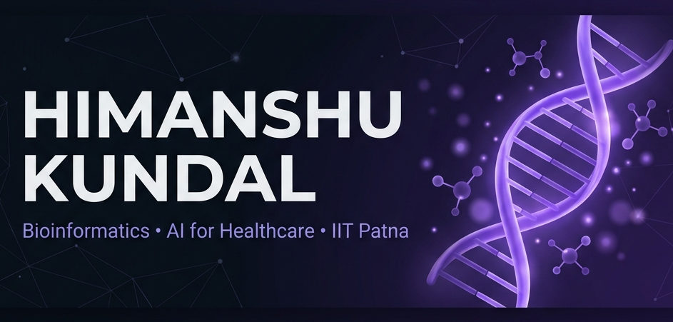
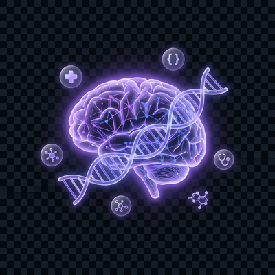
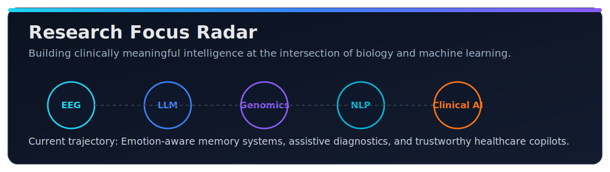

 

# Himanshu Kundal

### Architecting Intelligent Healthcare Systems from Biological Signals

 

  

## Neural Identity

<table>
<tr>
<td width="62%" valign="top">

I am a Computer Science and Data Analytics student at IIT Patna focused on turning biological and clinical complexity into practical AI systems.

I build where research meets deployment:
- EEG emotion intelligence and memory generation pipelines
- Multimodal healthcare assistants with real user value
- Bioinformatics-driven software for precision and safety

My design philosophy: scientific depth, product clarity, human impact.

</td>
<td width="38%" align="center" valign="top">
  
</td>
</tr>
</table>

> From Jammu, India. Obsessed with building technology that feels futuristic and useful on day one.

## Signal Stack

  

## Flagship Builds

| Project | Why it matters | Live |
|:--|:--|:--:|
| [Braill-Ai](https://github.com/HimanshuIITP/Braill-Ai) | Accessibility-first voice companion for visually impaired users | ⭐ |
| [MediSync](https://github.com/HimanshuIITP/MediSync) | Pre-visit symptom intelligence to improve doctor-patient time | [Demo](https://medi-sync-virid.vercel.app) |
| [MedSafe](https://github.com/HimanshuIITP/MedSafe) | Drug interaction support using RxNorm and openFDA signals | [Live](https://himanshuiitp.github.io/MedSafe/) |
| [EEG-memory-gen](https://github.com/HimanshuIITP/EEG-memory-gen) | Maps EEG emotion patterns into structured LLM memory | [Repo](https://github.com/HimanshuIITP/EEG-memory-gen) |
| [Portfolio](https://github.com/HimanshuIITP/portfolio) | Motion-rich personal web experience | [Live](https://himanshuiitp.github.io/portfolio/) |

## Research Focus Radar

## Current Momentum

- Investigating emotion-grounded memory systems for next-gen LLM agents
- Building clinically aware AI workflows for healthcare reliability
- Designing human-centered interfaces for complex biomedical intelligence

## GitHub Pulse

  

## Let's Build Something That Matters

Open to research collaborations, healthcare AI products, and ambitious hackathon builds.

